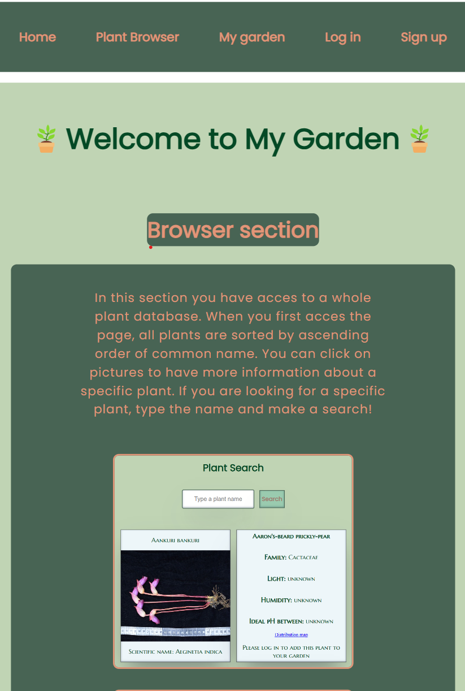
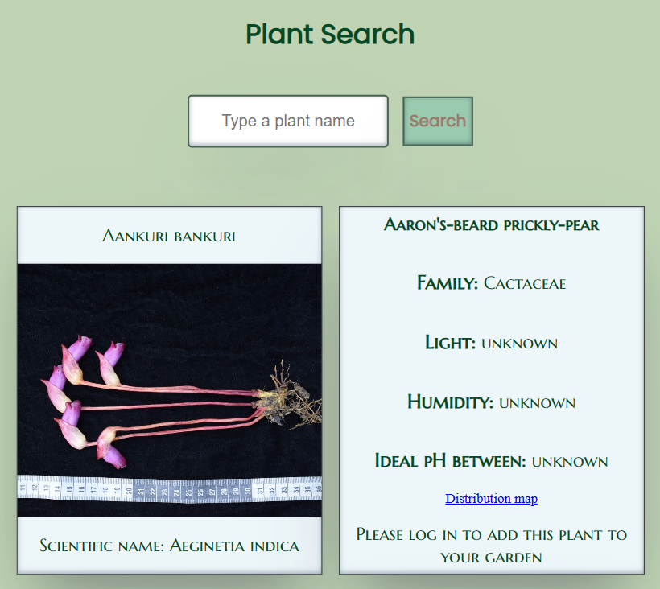
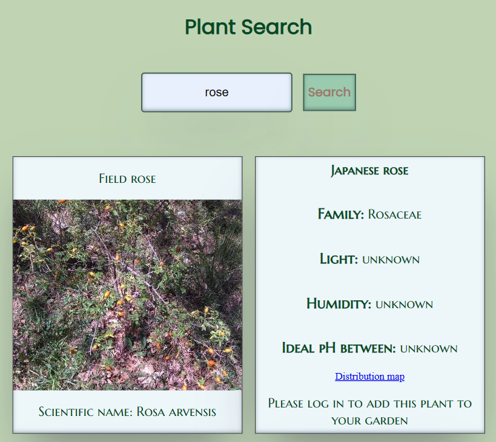
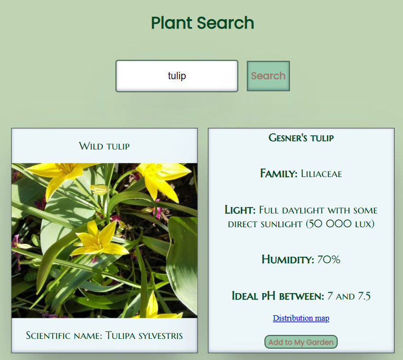
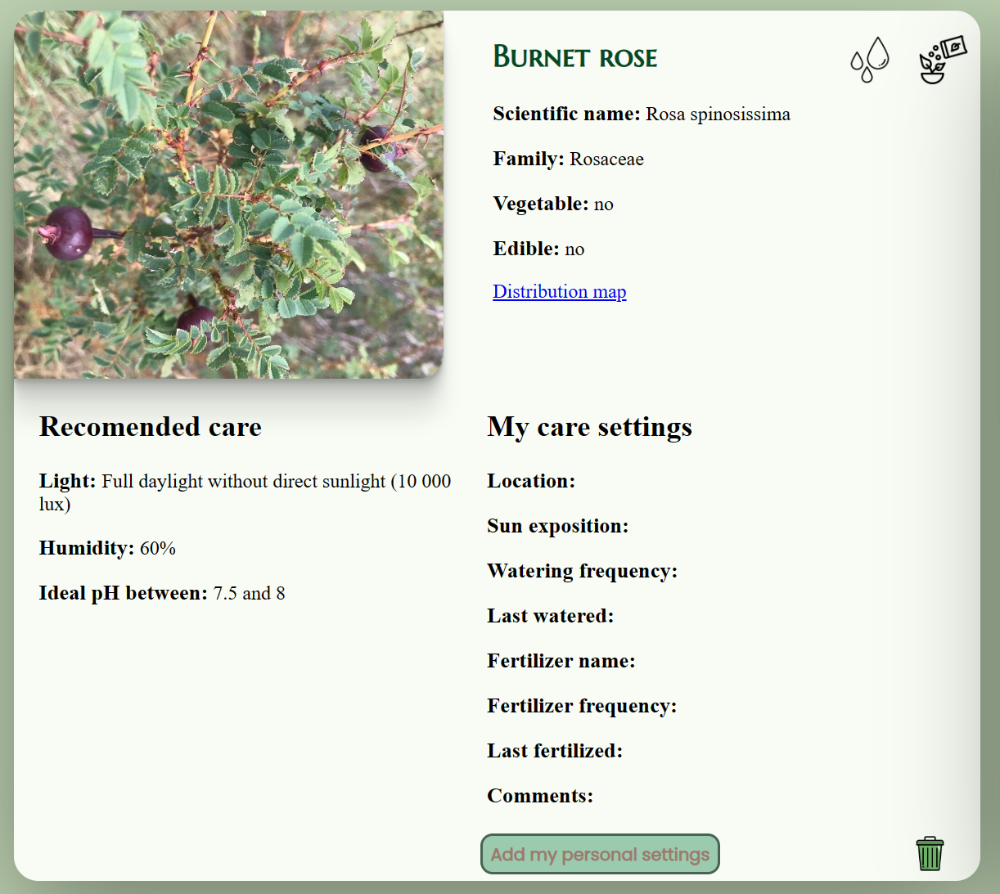
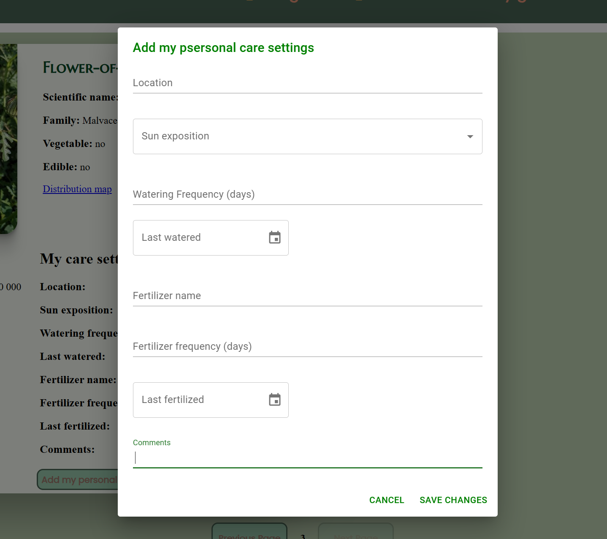
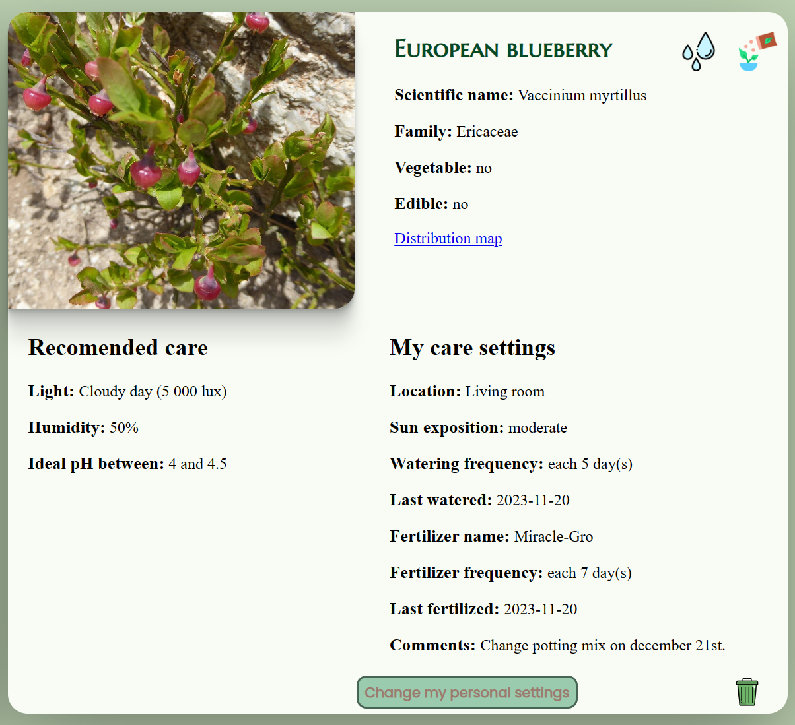
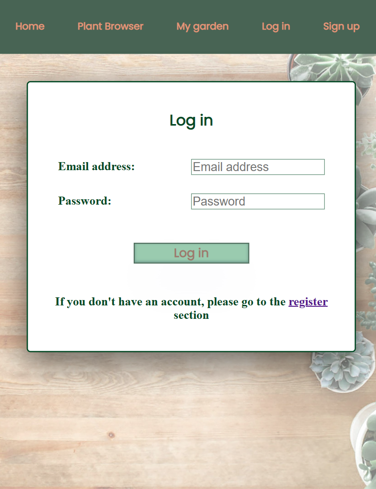
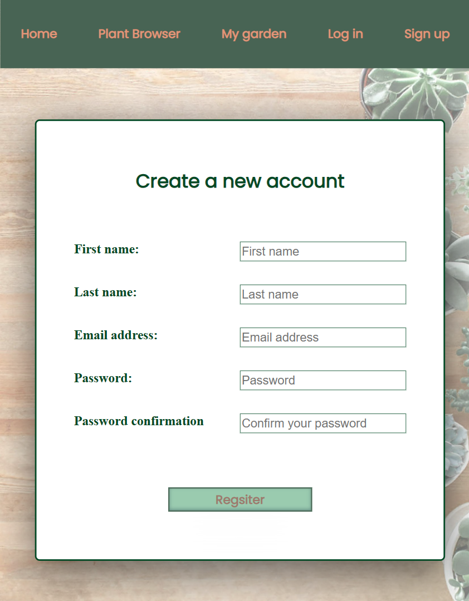

# My Garden (crb-final-project)

## Summary

This website is a plant browser and a user's plant library. Browser section can be use without registration and give you access to plant information from Trefle API. Logged user can use the special feature My Garden. In this section you can store plant, get plant information with recommended care and set your own plant data and care parameters. You also have acces to a task reminder for water and fertilizer.

## Features
- Plant Browser
- Access to plant information
- Create your own library
- Access to recommended care
- Option to store personal data and care settings
- Task reminder for water and fertilizer

## API
- [Trefle](https://github.com/treflehq/trefle-api)

## Tech Stack
- [HTML](https://developer.mozilla.org/en-US/docs/Glossary/HTML)
- [JavaScript](https://developer.mozilla.org/en-US/docs/Web/JavaScript)
- [CSS](https://developer.mozilla.org/en-US/docs/Web/CSS)
- [React](https://reactwithhooks.netlify.app/)
- [MongoDB](https://www.mongodb.com/fr-fr)
- [Express.js](https://expressjs.com/)
- [Node.js](https://nodejs.org/en)

## Homepage

This is the landing page where the website and features are described.

## Plant Browser

When you first navigate to this page you get acces to the whole database of plants sorted in alphabetic order of common name. This is where you can search for a specific plant name and get acces to more information. Plants are display on thumbnails with common name, picture and scientific name. You can click on a plant to get additional information. When you're logged in you can pick-up plants and add them to your own library. 

## My Garden

This section is reserved to registered user. In this section you have access to your plant library stored in MongoDB. Displayed on screen you can see picture, general information and recommended care. You also have the option to add you own data about the plant (ex: location in the house, sun exposition, fertilizer name, comments, etc.). In this personal care section you can also set the watering and fertilizing frequency as well as the last date those tasks were done. This set up the reminder icon on the top of the thumbnail that alert you when a task is due.  

## Log in / Sign up sections

Those sections displayed log in and register forms for the user to log in or to create a new account.  

